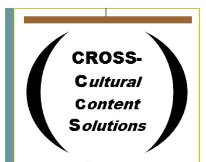

# Cross Cultural Content  

    

---

## Intro

Global Management Leader & Technical Writer | Expert in IT Delivery, Projects, Engagement | Specialization: Cloud Support, Education, AI/ML

As a seasoned professional in the Information Technology sector, I bring over a decade of expertise in managing deliveries, projects, engagements, and transitions within the AI/ML, cloud support, and software development realms. My career spans across diverse international settings, including Mexico, Germany, Switzerland, and the US, where I've excelled in cross-border communications and digital content management.

### Rebecca Ellis, Writer

<!-- Adjust the image sizes and alignment as needed -->

    
    

---

## Technical Writing 

### Samples

- [View Technical Writing Portfolio](https://s3.amazonaws.com/external_clips/4955139/Senior_TW_Portfolio_Rebecca_Ellis_2-1.pdf?1708468030)
- [Additional Technical Writing Samples](https://github.com/rebejellis/xcultural-content/blob/9acd4deeca2d6521f99c41d2f9dc5c69ca7acfb6/docs/assets/Additional%20TW%20Samples%20Rebecca%20Ellis%20-%20Procedures.pdf)
- [Learnship: Documenting a Language Learning Platform](https://s3.amazonaws.com/external_clips/4972829/Onboarding_guide_LEARNSHIP.pdf?1710973248)

### Linea Blockchain Network Solution and Use Case Studies

- **Publication:** [ethereumworldnews.com](http://ethereumworldnews.com)
Linea is a type of zkEVM L2 network, a second layer network, an Ethereum virtual machine that sits on top of Ethereum and participates in Ethereum’s security mechanism. Linea offloads transaction validation, reducing processing costs in the Ethereum execution environment by providing Ethereum with reports that transactions took place and were completed without revealing the details of each transaction. Linea preserves knowledge of the inner workings of these contracts while optimizing Ethereum's processing power.
- **File:** [View Linea Blockchain Network Solution and Use Case Studies](https://s3.amazonaws.com/external_clips/4877903/Consensys_Technical_Writing_Sample.pdf?1699985027)

---

## genAI Experiments

### More coming soon...

- [Read about my genAI experiment to restructure text for documentation](https://github.com/rebejellis/xcultural-content/blob/5df401a0c6bf210966a1cfeb5e6164b93461ad63/docs/assets/AI%20Experiment_%20Restructuring%20Text.pdf)
- **Article:** [GenAI and the Language Arts](https://s3.amazonaws.com/external_clips/4928048/GenAI_and_the_language_arts.pdf?1704913195)

---

## Resume

See my [technical writing resume here](https://github.com/rebejellis/xcultural-content/blob/39250c3eee6dbff9462f06d2b900629ccf5dd891/docs/assets/RebeccaEllisTWPMResume.pdf).

---

## Contact Me

[Reach out to Rebecca](https://www.savvycard.com/rebejellis/techwriter-savvycdard/1459_scid)
